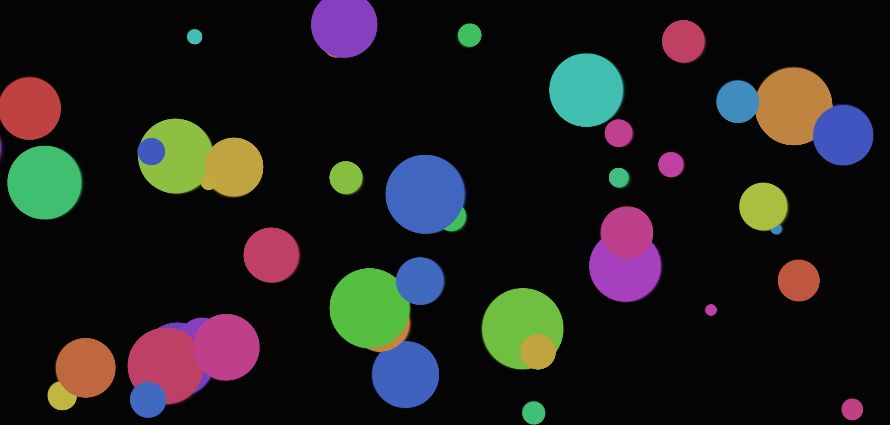

# Circles in JS
This is an example of creating like a Screensave using Javascript ECMA6. There is nothing specific used here only pure javascript Vanilla, that's all.
Enjoy it !

## How to use
Just clone or download the .zip file into your machine and run the html file on your browser.

## Improoving the result
If you want to cancel the program execution, just uncomment out the following lines, when the timeFrames reach out 5000 it will abort:

```javascript
    // if(timeFrame >= 5000) {
    //     cancelAnimationFrame(id);
    // }
```

If you want to add some text on screen, also you can uncomment out the following lines:

```javascript
    //ctx.clearRect(0, 0, canvas.width, canvas.height);

    // ctx.font = "30px Arial";
    // ctx.fillStyle = "white";
    // const frame = timeFrame ;
    // ctx.fillText("Time Frame: " + frame, 10, 50); 
```


## ScreenSaver result


## License
MIT License

## Author
Eduardo Diogo Garcia /
eduardo.diogo@gmail.com
